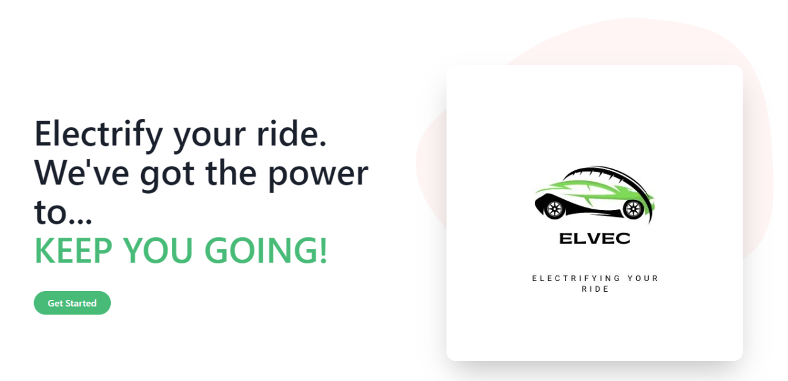

# Elvec

## Built for Hackhathon By

Muhammad Arham
Jorge Mancilla
Maliha Waqar
Oluwasayo Awoyemi
Mehtab Khalsa

## Inspiration 
Our inspiration to make this project was to improve the electric vehicle charging experience of users by allowing them to quickly identify and reserve local charging stations and also improve grid stability which is a common concern for electric companies. We are helping alleviate one of the primary pain points connected with electric cars.

## What is ELVEC
ELVEC is the name of the website that we created. It stands for "Electric Vehicle Charging Station." It is a platform that allows users to search for nearby charging stations and book them for a specified period, improving the overall electric vehicle charging experience. 

## What it does
The website provides a user-friendly interface where users can input their Zip-Code and filter through the available charging stations. Once a charging station is selected, users can reserve it for a specific time slot, which ensures that they have a designated charging spot when they arrive.

## How we Built it
Technologies Used: React, Next, Chakra, TORTOISE ORM.

We used react for front end as it allows creation of dynamic, responsive, and reusable components. Chakra is a UI library for React that provides pre-built components and styling options, making it easier and faster to create visually appealing user interfaces. TORTOISE ORM is a Python-based Object-Relational Mapping (ORM) library that simplifies database operations and provides an intuitive API for interacting with databases.
